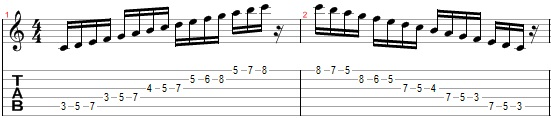
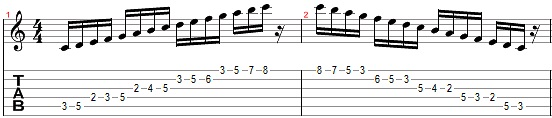
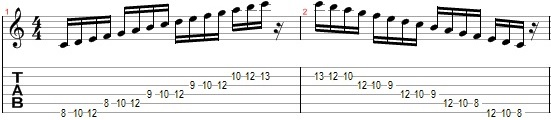
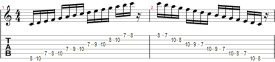

# Module 2

## C Major scale - shapes

Now that we already know the basic about what is a scale, we will show other shapes to C major scale

### C major starting with 5th string

### Other C major shape

### C major scale starting with the 6th string

### Other shape to C major starting with the 6th string

